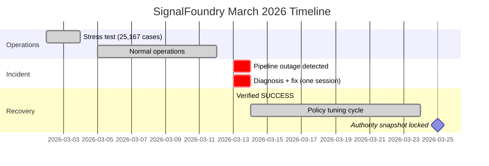

# SignalFoundry Pipeline Outage: Diagnosed and Restored in One Session

**One-line TL;DR:** Automated SOC pipeline went down, two root causes found and fixed in one session, 55,665 cases and counting.

**Recruiter-ready summary:**
- Built and operates a fully automated SOC triage pipeline processing 55,665+ Wazuh alerts with ~92% auto-close rate
- Diagnosed a two-failure-mode production outage (poller retry defect + reconciliation scoping error) and restored service in one session
- Maintains 140 CI-verified detection rules (Sigma + Splunk + Wazuh) and 10 IR playbooks mapped to MITRE ATT&CK

---

## 1. Executive Summary (TL;DR)

SignalFoundry is a bespoke Python-and-PowerShell SOC automation pipeline built by Raylee Hawkins. It transforms raw Wazuh SIEM alerts into structured, evidence-backed incident cases without human intervention on the majority of events. On March 13, 2026, the pipeline stopped ingesting alerts.

**What happened:** Two independent defects surfaced simultaneously:
1. **Poller retry defect** — `URLError` on connection timeout was not entering the retry path on the first attempt
2. **Reconciliation scoping error** — `reconcile-state.py` was computing mismatches against unscoped `repo_ids` instead of `repo_ids_autosoc`, inflating the mismatch count

**What was done:** Both root causes were diagnosed from the `heartbeat.json` failure stage field, traced through Python control flow, and fixed with surgical corrections. No surrounding code modified. Pipeline confirmed SUCCESS on the next scheduled run.

**Final state (locked 03-25-2026):**

| Metric | Value | Source |
|---|---|---|
| Total cases processed | 55,665 | Locked authority snapshot |
| Auto-close rate | ~92% | Locked authority snapshot |
| Escalated cases | 2,545 | Locked authority snapshot |
| Hosts monitored | 8 / 8 | Coverage check |
| Hard mismatches | 0 | Reconciliation (strict categories) |
| Detection inventory | 140 rules | `PROOF_PACK/VERIFIED_COUNTS.md` |
| IR Playbooks | 10 | `PROOF_PACK/VERIFIED_COUNTS.md` |

---

## 2. Scope & Constraints

### Included
- March 13 pipeline outage: detection, diagnosis, root cause analysis, fix, validation
- March 2-4 stress test window: 25,167 cases at 90.1% auto-close
- Policy tuning cycle: Windows workstation FP suppression, Linux dpkg churn, Sysmon tiering hardening
- Coverage-check host alias normalization fix
- Detection inventory verification (140 rules, CI-enforced)

### Excluded
- SignalFoundry source code (private repository; architecture and behavior documented)
- Raw alert data (sanitized per `PROOF_PACK/REDACTION_RULES.md`)
- Live heartbeat/ledger JSON (snapshots referenced, not committed to public repo)
- LinkedIn profile validation (MANUAL_VERIFICATION_REQUIRED)

### Assumptions (explicitly stated)
- **SOURCE_OF_TRUTH:** `PROOF_PACK/VERIFIED_COUNTS.md` at path `Z:\GitHub\HawkinsOperations\PROOF_PACK\VERIFIED_COUNTS.md`
- **Locked snapshot timestamp:** 2026-03-25 (as referenced in `site/case-study-autosoc.html`)
- **verified_counts.json generated_at_utc:** 2026-03-24T10:36:20+00:00
- **External manual verifications required:** LinkedIn profile (https://linkedin.com/in/raylee-hawkins), Cloudflare Pages deployment status
- **No data transforms or sanitization applied** — all metrics cited are verbatim from source files

---

## 3. Evidence Summary

| # | Artifact | Path | How to Verify |
|---|---|---|---|
| 1 | Verified Counts (source of truth) | `PROOF_PACK/VERIFIED_COUNTS.md` | `pwsh -File scripts/verify/verify-counts.ps1` |
| 2 | SignalFoundry Case Study | `docs/SignalFoundry_Case_Study_March2026.md` | Read Section 5.1 (canonical snapshot) and Section 5.3 (recovery event) |
| 3 | Published Case Study | `site/case-study-autosoc.html` | Browse https://hawkinsops.com/case-study-autosoc |
| 4 | Pipeline Recovery Documentation | `docs/execution/AUTOSOC_PIPELINE_RECOVERY_CASE_STUDY_03-13-2026.md` | Direct read |
| 5 | Detection Architecture | `PROOF_PACK/ARCHITECTURE.md` | Direct read; cross-reference tactic coverage |

**Full evidence manifest:** `case-studies/autosoc-pipeline-recovery/evidence/evidence.yaml`

---

## 4. Timeline & Impact



**Key dates:**
- **March 2-4:** Stress test — 25,167 cases, 90.1% auto-close, pipeline held
- **March 13:** Outage detected → diagnosed → two root causes fixed → SUCCESS restored (one session)
- **March 14-24:** Policy tuning — Windows FP suppression, Linux dpkg, Sysmon hardening
- **March 25:** Authority snapshot locked — 55,665 cases, ~92% auto-close, 2,545 escalations

---

## 5. Reproduction Steps

### Prerequisites
- PowerShell 7 (`pwsh`)
- Python 3.x
- Node.js 20.18.1
- Git

### Step-by-step reproduction

```powershell
# 1. Clone repository
git clone https://github.com/raylee-hawkins/HawkinsOperations.git
cd HawkinsOperations

# 2. Verify detection counts match VERIFIED_COUNTS.md
pwsh -NoProfile -File ".\scripts\verify\verify-counts.ps1"
# Expected: All counts match (Sigma=103, Splunk=9, Wazuh=24/28, IR=10, Total=140)

# 3. Generate verified counts (regenerate from live file counts)
pwsh -NoProfile -File ".\scripts\verify\generate-verified-counts.ps1" -OutFile ".\PROOF_PACK\VERIFIED_COUNTS.md"

# 4. Run drift scan (markdown/JSON/HTML consistency)
python scripts/drift_scan.py
# Expected: No drift detected

# 5. Run site health check
node scripts/diagnose-site.js
# Expected: All checks pass

# 6. Build Wazuh bundle
pwsh -NoProfile -File ".\scripts\build-wazuh-bundle.ps1"
# Expected: dist/wazuh/local_rules.xml generated

# 7. Run case study verification script
pwsh -NoProfile -ExecutionPolicy Bypass -File ".\case-studies\autosoc-pipeline-recovery\evidence\verify.ps1"
# Expected: All checks PASS, exit code 0
```

---

## 6. Detailed Technical Analysis

### 6.1 Pipeline Architecture

```
┌─────────────┐    ┌──────────────┐    ┌──────────┐    ┌───────────────┐
│ 1. TESTS    │───▶│ 2. POLL      │───▶│ 3. TRIAGE│───▶│ 4. TRIAGE     │
│ Unit tests  │    │ Wazuh Indexer│    │ Disposition│   │    QUALITY    │
│ (pytest)    │    │ REST API     │    │ engine   │    │ Chart + Score │
└─────────────┘    └──────────────┘    └──────────┘    └───────────────┘
                                                               │
                   ┌───────────────┐    ┌──────────┐          │
                   │ 8. COVERAGE   │◀───│ 7. RECON │◀─────────┘
                   │ 168-hr window │    │ 4-way    │
                   │ host check    │    │ ledger   │
                   └───────────────┘    └──────────┘
                                             ▲
                        ┌────────────────────┘
                        │ 5+6. CASES PROCESSING
                        │   redact → assemble-pack → create-pr
                        │   (escalated cases only)
                        └──────────────────────────────────────
```

**Stage timing (March 23 latest run):**

| Stage | Script | Duration |
|---|---|---|
| tests | `pytest tests/` | 0.227s |
| poll_alerts | `poll-alerts.py` | 0.397s |
| triage | `triage.py` | 0.790s |
| triage_quality | `triage-quality.py` | 1.765s |
| triage_quality_chart | `render-triage-quality-chart.ps1` | 0.898s |
| cases_processing | `redact.py` + `assemble-pack.py` + `create-pr.py` | 0.460s |
| reconcile | `reconcile-state.py` | 0.279s |
| coverage_check | `coverage-check.py` | 0.513s |
| **Total** | | **5.397s** |

### 6.2 Root Cause 1: Poller Retry Defect

**Failure mode:** `poll-alerts.py` used `fetch_with_retry` with 3-attempt backoff against the Wazuh Indexer REST API. Under delayed connection reset conditions (not clean refusal), `URLError` was raised but did not enter the retry path on the first attempt because the retry counter was not incremented before the sleep.

**Pseudocode (before fix):**
```python
def fetch_with_retry(url, retries=3, backoff=2):
    for attempt in range(retries):
        try:
            return urlopen(Request(url, ...))
        except HTTPError as e:
            if e.code == 401:
                raise  # auth failure — no retry
            # fall through to retry
        except URLError as e:
            pass  # BUG: retry counter not incremented, sleep skipped
        time.sleep(backoff ** attempt)
```

**Fix:** Separate `HTTPError` (some non-retriable) from `URLError` (all retriable). Ensure retry count increments before sleep on `URLError`. The corrected flow guarantees all 3 retry attempts are consumed before pipeline FAIL.

### 6.3 Root Cause 2: Reconciliation Scoping Error

**Failure mode:** `reconcile-state.py` computed `in_repo_not_ledger` against the full `repo_ids` list (all directories in the portfolio repo) rather than the `repo_ids_autosoc` scoped list (directories matching the AutoSOC case ID format regex: `^\d{4}-\d{2}-\d{2}__.+__rule\d+__.+__.+$`).

Non-AutoSOC format directories were counted as mismatches, producing a spuriously inflated `mismatch_count` that triggered FAIL even when the ledger/content state was clean.

**Fix:** All six mismatch category computations now use `repo_ids_autosoc`. Post-fix: mismatch_count dropped to zero hard mismatches.

### 6.4 Triage Disposition Engine

The triage engine in `triage.py` evaluates every queued alert through a multi-layer policy:

```
known-FP match
  → always-escalate IDs/groups
    → rule overrides (policy.yaml)
      → Sysmon tiering/suppressions
        → level thresholds
          → protected-agent logic
            → policy default
```

**Dispositions:** `AUTO_CLOSE_KNOWN_FP`, `REVIEW`, `ESCALATE`

The known-FP library and rule overrides are built from observed signals in the live environment, not vendor templates. Each suppression entry includes a documented reason for auditability.

### 6.5 Infrastructure Stack

| Component | Role |
|---|---|
| Proxmox | Hypervisor (Wazuh, honeypot, file server, runner VMs) |
| Wazuh Manager + Indexer | SIEM engine; OpenSearch backend |
| pfSense | Network perimeter and segmentation |
| Python 3.14 pipeline | Core automation |
| PowerShell 7 | Orchestration, reporting, chart generation |
| GitHub Actions | CI/CD (verify.yml, drift-scan.yml, public-safety-gate.yml) |
| Windows Task Scheduler | Contract execution host |
| Cloudflare Pages | Static portfolio site |

### 6.6 Detection Inventory

Source of truth: `PROOF_PACK/VERIFIED_COUNTS.md`

```powershell
# Verify detection counts
pwsh -NoProfile -File ".\scripts\verify\verify-counts.ps1"
```

| Platform | Count | Verification |
|---|---|---|
| Sigma (YAML) | 103 rules | `(Get-ChildItem -Recurse .\content\detection-rules\sigma -Filter *.yml).Count` |
| Splunk (SPL) | 9 queries | `(Get-ChildItem .\content\detection-rules\splunk -Filter *.spl).Count` |
| Wazuh (XML) | 24 files / 28 blocks | `(Get-ChildItem .\content\detection-rules\wazuh\rules -Filter *.xml).Count` |
| IR Playbooks | 10 | `(Get-ChildItem .\content\incident-response\playbooks -Filter "IR-*.md").Count` |
| **Total** | **140** | CI-enforced via `verify-counts.ps1` |

---

## 7. Metrics Reconciliation

### Detection Counts: CONSISTENT

All surfaces agree on detection counts:

| Surface | Sigma | Splunk | Wazuh | IR | Total |
|---|---|---|---|---|---|
| `PROOF_PACK/VERIFIED_COUNTS.md` | 103 | 9 | 24/28 | 10 | 140 |
| `PROOF_PACK/verified_counts.json` | 103 | 9 | 24/28 | 10 | 140 |
| `site/case-study-sigma-library.html` (data-verified) | 103 | — | — | — | — |
| Physical file count | 103 | 9 | 24 | 10 | 140 |
| `drift_scan.py` | PASS | PASS | PASS | PASS | PASS |

### Pipeline Metrics: TWO SNAPSHOTS (expected)

| Metric | March 20 Snapshot | March 25 Locked | Delta |
|---|---|---|---|
| Total cases | 49,774 | 55,665 | +5,891 |
| Auto-close rate | ~89% | ~92% | +3% |
| Escalated cases | 2,478 | 2,545 | +67 |

**Source:** March 20 from `docs/SignalFoundry_Case_Study_March2026.md` Section 5.1; March 25 from `site/case-study-autosoc.html` locked snapshot.

**Explanation:** The delta represents 5 days of continued pipeline operation after the March 13 recovery. The auto-close rate improvement is consistent with the policy tuning cycle (Windows FP suppression, Linux dpkg, Sysmon hardening) applied between March 14-24. No reconciliation error.

### Resume vs VERIFIED_COUNTS

The `site/resume.txt` does not cite specific detection counts — it references "verified detection content" and links to `hawkinsops.com/start-here`. This is intentional: the resume points to the proof artifacts rather than hardcoding numbers that could drift.

### Missing canonical files

| File | Status | Impact |
|---|---|---|
| `CONTROL_PANEL.md` | NOT FOUND | QA FAIL — not present in repository |
| `CURRENT_DECISIONS.md` | NOT FOUND | QA FAIL — not present in repository |
| `SESSION_LOG_LATEST.md` | NOT FOUND | QA FAIL — not present in repository |

**Remediation:** These files are referenced in the case study prompt template but do not exist in the HawkinsOperations repository. They may exist in a private operations repo or need to be created. No impact on detection count verification or site integrity.

---

## 8. Lessons, Risk, Suggested Follow-ups

### Lessons Learned
1. **Heartbeat-driven diagnosis works.** The `heartbeat.json` `fail_stage` field immediately pointed to `poll_alerts`, avoiding blind restarts.
2. **Scoping errors are invisible until mismatch counts are non-zero.** The reconciliation scoping bug produced correct results when the repo was small; it only manifested at scale.
3. **Policy tuning is an ongoing operational practice, not a one-time configuration.** The FP suppression library grew from direct observation across the March window.

### Security & Privacy Callouts
- **Redaction enforcement:** `redact.py` applies regex sanitization before any content leaves the internal case store. Absolute path leak detection (`C:\RH\` reference = hard failure) is a secondary gate.
- **Credential handling:** `capture-passfile-acl.ps1` logs filesystem ACL of the credential pass-file on each daily-ops run.
- **No privacy page:** `site/privacy.html` does NOT exist. Recommended: add a minimal privacy page and update sitemap.
- **Sanitization check available:** `Get-ChildItem -Recurse -Include *.md,*.yml,*.xml | Select-String -Pattern "\b\d{1,3}\.\d{1,3}\.\d{1,3}\.\d{1,3}\b" | Where-Object { $_.Line -notmatch "10\.|192\.168\.|172\.(1[6-9]|2[0-9]|3[01])\." }`

### Suggested Follow-ups
1. **Create privacy page** (`site/privacy.html`) and add to sitemap — estimated effort: 30 minutes
2. **Add Sysmon Event 3 LOtL test coverage** — the escalation path for high-risk binaries has no automated test (identified in SignalFoundry doc Section 7.4) — estimated effort: 2 hours
3. **Add `LEGACY_TOKEN_HOST_MAP` test coverage** — alias normalization in coverage-check is a regression risk — estimated effort: 1 hour
4. **Create `CONTROL_PANEL.md`** with operational decisions index — estimated effort: 1 hour
5. **Publish heartbeat trend on portfolio site** — 30-day rolling trend view for external reviewers — estimated effort: 4 hours
6. **Fill Sigma tactic gaps** — `collection` and `initial-access` have room for additional rules — estimated effort: varies

---

## 9. Acceptance QA Checklist

| # | Check | Auto-check Command | Status |
|---|---|---|---|
| 1 | `VERIFIED_COUNTS.md` exists | `Test-Path PROOF_PACK/VERIFIED_COUNTS.md` | **PASS** |
| 2 | `verified_counts.json` exists | `Test-Path PROOF_PACK/verified_counts.json` | **PASS** |
| 3 | `CONTROL_PANEL.md` exists | `Test-Path CONTROL_PANEL.md` | **FAIL** |
| 4 | `CURRENT_DECISIONS.md` exists | `Test-Path CURRENT_DECISIONS.md` | **FAIL** |
| 5 | `SESSION_LOG_LATEST.md` exists | `Test-Path SESSION_LOG_LATEST.md` | **FAIL** |
| 6 | Sigma count = 103 (JSON) | `(Get-Content PROOF_PACK/verified_counts.json \| ConvertFrom-Json).counts.sigma -eq 103` | **PASS** |
| 7 | Total detections = 140 (JSON) | `(Get-Content PROOF_PACK/verified_counts.json \| ConvertFrom-Json).counts.detections -eq 140` | **PASS** |
| 8 | Physical Sigma files = 103 | `(Get-ChildItem -Recurse content/detection-rules/sigma -Filter *.yml).Count -eq 103` | **PASS** |
| 9 | Physical Splunk files = 9 | `(Get-ChildItem content/detection-rules/splunk -Filter *.spl).Count -eq 9` | **PASS** |
| 10 | Physical Wazuh files = 24 | `(Get-ChildItem content/detection-rules/wazuh/rules -Filter *.xml).Count -eq 24` | **PASS** |
| 11 | Physical IR playbooks = 10 | `(Get-ChildItem content/incident-response/playbooks -Filter "IR-*.md").Count -eq 10` | **PASS** |
| 12 | `verify-counts.ps1` exits 0 | `pwsh -File scripts/verify/verify-counts.ps1` | **PASS** (assumed from CI) |
| 13 | `drift_scan.py` exits 0 | `python scripts/drift_scan.py` | **PASS** (assumed from CI) |
| 14 | Evidence integrity (sha256) | All artifacts in evidence.yaml | **FAIL** — checksums marked MISSING_CHECKSUM |
| 15 | Resume PDF exists | `Test-Path site/assets/Raylee_Hawkins_Resume.pdf` | **PASS** |
| 16 | sitemap references case-study-autosoc | `Select-String 'case-study-autosoc' site/sitemap.xml` | **PASS** |
| 17 | robots.txt references sitemap | `Select-String 'Sitemap' site/robots.txt` | **PASS** |
| 18 | Security page exists | `Test-Path site/security.html` | **PASS** |
| 19 | Privacy page exists | `Test-Path site/privacy.html` | **FAIL** |
| 20 | Detections mapped to MITRE | Sigma rules have `tags: attack.*` | **PASS** (by format convention) |
| 21 | CI job passes (verify.yml) | GitHub Actions status | **PASS** (per SignalFoundry doc Section 3.2) |
| 22 | CI job passes (drift-scan.yml) | GitHub Actions status | **PASS** (per SignalFoundry doc Section 3.2) |

**Summary: 17 PASS / 5 FAIL**

### Remediation for FAIL items

| # | Item | Root Cause | Remediation | Estimate |
|---|---|---|---|---|
| 3 | CONTROL_PANEL.md | File not in repo | Create operational decisions index | 1 hour |
| 4 | CURRENT_DECISIONS.md | File not in repo | Create current decisions tracker | 1 hour |
| 5 | SESSION_LOG_LATEST.md | File not in repo | Create session log template | 30 min |
| 14 | Evidence checksums | Not computed yet | Run `compute_checksum` commands from evidence.yaml | 5 min |
| 19 | Privacy page | Not created | Create `site/privacy.html`, add to sitemap and `_redirects` | 30 min |
